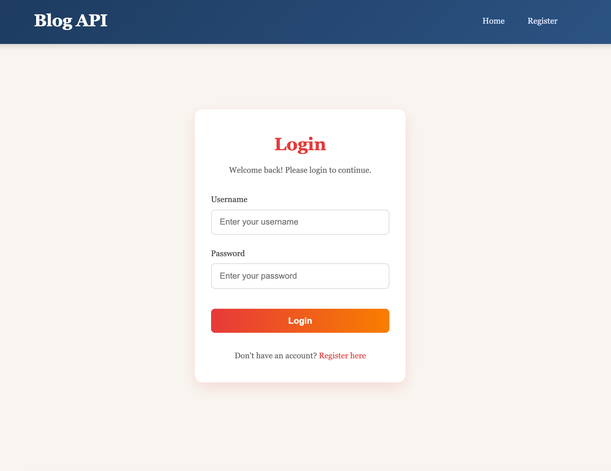
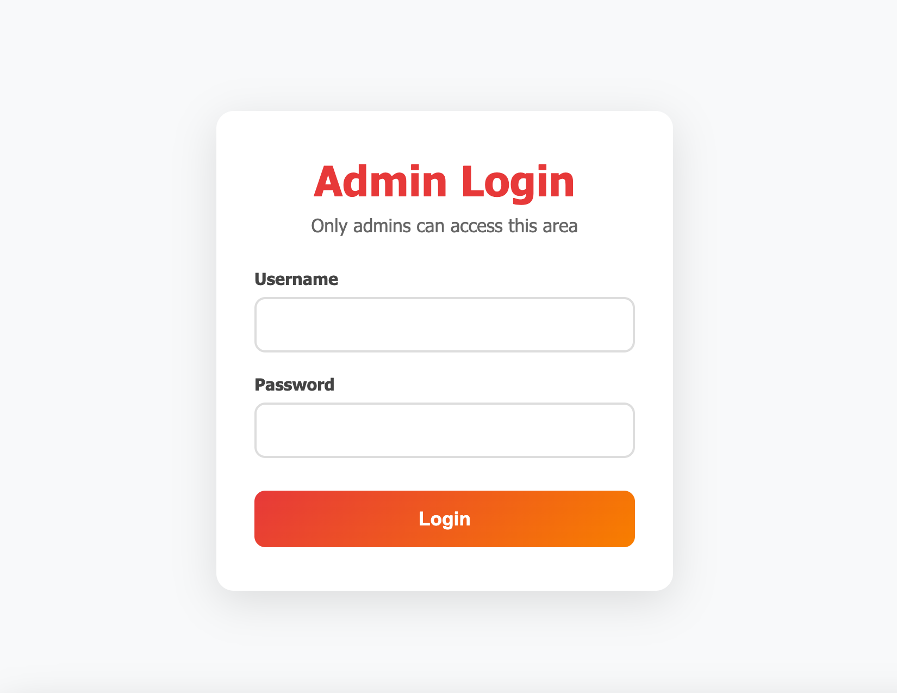

# 📝 Blog Admin Dashboard (Frontend)

# blog-public

App runs on:
https://marijaavramovic.github.io/blog-public/

Frontend for Admin runs on:
https://blog-admin-marijaa.netlify.app/
 

Backend API is running on:
https://blog-api-wwtw.onrender.com/

Separate GitHub repos for each of the three apps:

 Public: https://github.com/MarijaAvramovic/blog-public  

 Admin: https://github.com/MarijaAvramovic/blog-admin (current)

 API: https://github.com/MarijaAvramovic/blog-api

 
 
A modern and responsive admin dashboard for managing blog posts. Built with React, this interface allows admins to create, view, and manage posts with a clean UI and smooth user experience.

---

## 🚀 Features

* 🔐 Admin authentication (JWT-based)
* 📄 View all posts in a responsive grid
* ➕ Create new posts
* 📝 Edit and manage existing posts
* 🗑️ Delete posts
* 🎨 Clean and modern UI (light dashboard + dark editor)
* ⚡ Fast and simple API integration

---

## 🛠️ Tech Stack

* **React**
* **React Router DOM**
* **CSS (custom styling)**
* **Fetch API**

